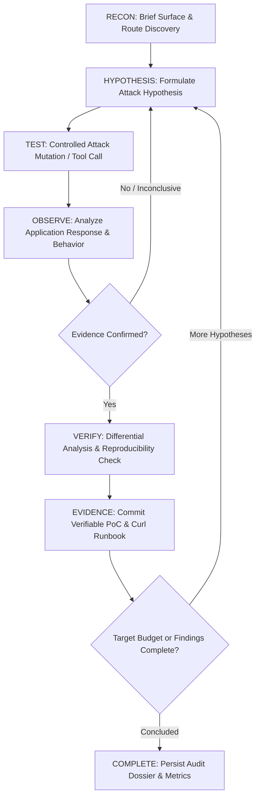

# StressX — Autonomous AI Security Testing System

[](https://www.python.org/)
[](https://fastapi.tiangolo.com/)
[](https://www.docker.com/)
[](LICENSE)

> [!WARNING]
> **AUTHORIZED RESEARCH & TESTING USE ONLY**
> StressX is an autonomous security auditing and adversarial testing research system designed strictly for authorized penetration testing, vulnerability assessment, and security research against systems you own or have explicit, documented permission to test. Unauthorized access or hostile testing against unauthorized infrastructure is strictly prohibited.

---

## Overview

**StressX** is an autonomous, AI-driven security auditing platform. Unlike static analysis tools (SAST) or predetermined vulnerability scanners (DAST), StressX functions as an attack-first autonomous agent that:

1. **Deploys and Isolates Target Applications:** Spins up user project directories or vulnerable benchmark targets in resource-bounded Docker sandboxes (with CPU, memory, and network isolation).
2. **Conducts Active Hypothesis-Driven Attacks:** Formulates concrete security hypotheses (e.g., Broken Object Level Authorization / IDOR, SQL injection, Privilege Escalation, Information Disclosure) rather than running endless passive scans.
3. **Executes Controlled Testing Cycles:** Dispatches targeted HTTP requests, parses responses, detects behavioral diffs, and observes state mutations.
4. **Verifies Evidence Empirically:** Generates verifiable, reproducible proof-of-concept runbooks (including exact curl commands, response diffs, and status codes) for every reported finding. Zero fabricated or hallucinated vulnerabilities.
5. **Maintains Verifiable Metrics & Append-Only Action Logs:** Records exact numerical metrics, HTTP latencies, tool calls, and redacted action trails in persistent JSON dossiers.

---

## Autonomous Attack-First Feedback Loop

StressX avoids passive scanning loops by executing a strict, progressive test cycle with anti-repetition guards:



---

## Core Architecture

```
stressx-ai/
├── app/
│   ├── agent/                 # Autonomous agent controller & reasoning loop
│   │   ├── controller.py      # Execution feedback loop with anti-repetition guards
│   │   └── prompts.py         # System prompt & structured context synthesizer
│   ├── tools/                 # Controlled security testing tools
│   │   ├── base.py            # BaseTool with target boundary validation
│   │   ├── registry.py        # ToolRegistry & boundary sandbox
│   │   ├── discover_http_surface.py
│   │   ├── send_http_request.py
│   │   ├── inspect_http_response.py
│   │   ├── manage_test_session.py
│   │   ├── run_browser.py
│   │   ├── inspect_page.py
│   │   ├── compare_responses.py
│   │   ├── record_evidence.py
│   │   └── finish_audit.py
│   ├── target/                # Target isolation, sandboxing, and benchmark
│   │   ├── app.py             # Intentionally vulnerable benchmark application
│   │   ├── runner.py          # Benchmark process / container lifecycle manager
│   │   ├── detector.py        # Automatic project framework & port detector
│   │   └── sandbox.py         # DockerProjectSandbox with strict CPU/RAM limits
│   ├── evidence/              # Evidence store, report export, and redaction
│   │   ├── store.py           # Persistent audit dossier & aggregate metrics manager
│   │   └── redact.py          # Automated scrubbing of JWTs, keys, credentials
│   ├── models/                # Pydantic domain models
│   │   ├── target.py          # Target boundary rules (allowed hosts/ports)
│   │   ├── session.py         # AuditSession state machine & phases
│   │   ├── metrics.py         # AuditMetrics & AggregateMetrics instrumentation
│   │   ├── finding.py         # Finding, severity, category, status
│   │   ├── evidence.py        # Verifiable empirical evidence
│   │   ├── hypothesis.py      # Security reasoning hypotheses
│   │   ├── observation.py     # Structured perception of tool results
│   │   ├── attempt.py         # Attack attempt logs
│   │   ├── decision.py        # Structured agent decisions
│   │   └── adapter.py         # LocalModel adapter (Ollama LLaMA 3 & heuristic engine)
│   ├── api/                   # REST API for audit session management
│   │   └── server.py          # FastAPI service endpoints
│   └── __main__.py            # CLI entry point with interactive target selection
├── sample_projects/           # Realistic sample applications for auditing
│   └── python_api/            # Intentionally vulnerable FastAPI project
├── tests/                     # Comprehensive pytest test suite (55+ tests)
├── Dockerfile                 # Container packaging for StressX
├── requirements.txt           # Project dependencies
└── README.md
```

---

## Controlled Testing Tools

StressX equips the AI agent with 9 specialized tools strictly bounded by the target scope:

| # | Tool | Description |
|:---|:---|:---|
| 1 | `discover_http_surface` | Probes common routes, OpenAPI/Swagger specifications, and API documentation. |
| 2 | `send_http_request` | Dispatches probes with custom verbs, headers, and payloads; measures response latency and flags anomalies. |
| 3 | `inspect_http_response` | Performs deep header analysis (CORS, HSTS, CSP), technology disclosures, and secret leakage. |
| 4 | `manage_test_session` | Authenticates test users, switches identity contexts, and enables multi-tenant authorization testing. |
| 5 | `run_browser` | Runs client-side DOM rendering to detect dynamic routes and client errors. |
| 6 | `inspect_page` | Extracts HTML forms, input parameters, and anti-CSRF token protections. |
| 7 | `compare_responses` | Performs differential analysis between baseline requests and attack mutations. |
| 8 | `record_evidence` | Links verified empirical HTTP transactions, response previews, and curl commands to a confirmed finding. |
| 9 | `finish_audit` | Concludes the audit session and compiles statistics. |

---

## Target Sandboxing & Isolation

StressX provides two primary modes of operation:

1. **User Project Folder Mode:**
   - Supply any local directory (e.g. `C:\Projects\my-api`).
   - Automatically detects framework (`Spring Boot / Maven`, `Spring Boot / Gradle`, `Node.js`, `Python`).
   - Packages the project in an isolated scratch build context and launches it in a resource-bounded Docker container (`1.0 CPU`, `1024MB RAM`, isolated Docker network).
   - Monitors container readiness, performs health checks, and guarantees automatic teardown upon audit completion.
2. **Built-in Vulnerable Benchmark Mode:**
   - An intentionally vulnerable benchmark application (`app.target.app`) featuring authentic flaws:
     - Broken Object-Level Authorization (BOLA/IDOR) on user profile endpoints
     - SQL Injection in search query concatenation
     - Hardcoded credential and environment variable leaks (`/debug/env`)
     - Role/header spoofing privilege escalation (`X-Original-Role: admin`)
     - Unconstrained resource allocation on export endpoints

---

## Getting Started

### 1. Installation

```bash
git clone https://github.com/Ayush5424/StressX.git
cd StressX

python -m venv .venv
# On Windows:
.venv\Scripts\activate
# On Linux/macOS:
source .venv/bin/activate

pip install -r requirements.txt
```

### 2. Local AI Model Setup (Optional)

StressX is designed for local open-weight model execution via [Ollama](https://ollama.com/):

```bash
# Pull and start LLaMA 3
ollama run llama3
```

StressX automatically connects to `http://127.0.0.1:11434`. If Ollama is not running, StressX automatically falls back to its deterministic cognitive security reasoning engine.

### 3. Launching an Audit

Run the interactive CLI:

```bash
python -m app
```

You will be prompted:
```text
Enter the path to the project folder you want StressX to audit:
(Or press Enter to test the built-in vulnerable benchmark target):
```

### 4. Running Automated Tests

Run the comprehensive test suite:

```bash
pytest tests/ -v
```

---

## Verifiable Evidence & Metrics

Every audit generates a complete, reproducible evidence dossier in `audit_reports/<session_id>/`:

- `report.md`: Executive summary and vulnerability disclosure report.
- `report.json`: Machine-readable audit summary.
- `findings.json`: Verified security findings with severity, CVSS category, and reproduction runbooks.
- `evidence.json`: Exact HTTP request/response artifacts, timestamps, and curl reproduction commands.
- `metrics.json`: Numeric metrics measuring requests, latencies, hypotheses, findings, and tool calls.
- `actions.jsonl`: Append-only, sanitized action log of all agent decisions and perceptions.

Cumulative audit metrics are stored idempotently across runs in `audit_reports/aggregate_metrics.json`.

---

## Security & Ethics

- **Strict Scope Boundaries:** Target host and port restrictions are enforced at the transport layer. Any outbound request beyond the target boundary is blocked.
- **Sensitive Data Redaction:** All persisted logs and reports automatically redact passwords, API tokens, JWTs, and private keys.
- **Resource Constraints:** Containers run with hard limits on CPU cores and memory usage to prevent denial of service on the host system.

---

## License

This project is licensed under the MIT License - see the [LICENSE](LICENSE) file for details.
